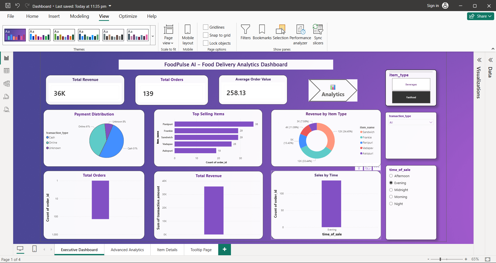
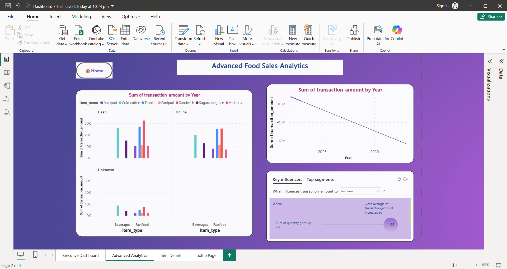
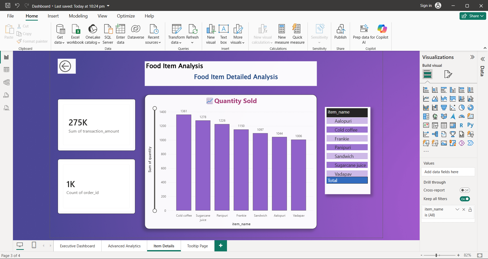
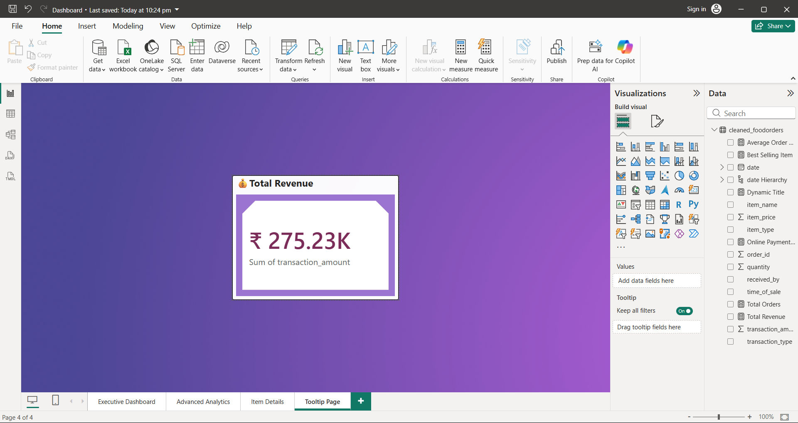

# FoodPulse AI - Food Delivery Analytics Dashboard

Interactive Food Delivery Analytics Dashboard developed using Python and Power BI to analyze sales trends, revenue, customer behavior, and food ordering patterns.

---

# 🚀 Dashboard Preview

## 🏠 Executive Dashboard

---

## 📈 Advanced Analytics

---

## 🍔 Item Details

---

## 💡 Tooltip Page

---

# 🛠 Tools & Technologies

- Python
- Pandas
- Power BI
- DAX
- Data Visualization
- Business Analytics

---

# ✨ Features

- KPI Cards
- Forecasting
- Drill-through Reports
- Tooltips
- Interactive Slicers
- AI Visuals
- Modern Dashboard UI

---

# 📊 Insights Generated

- Revenue Trends
- Top Selling Items
- Peak Sales Time Analysis
- Payment Distribution
- Category-wise Revenue Insights

---

# 👩‍💻 Developed By

Sushmasri Ganni
